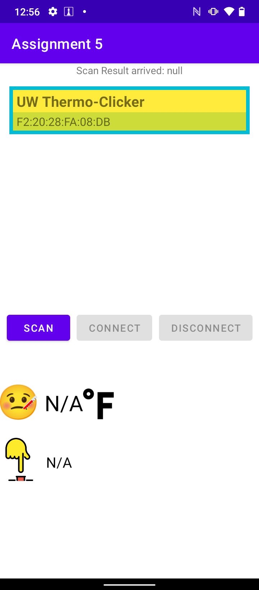
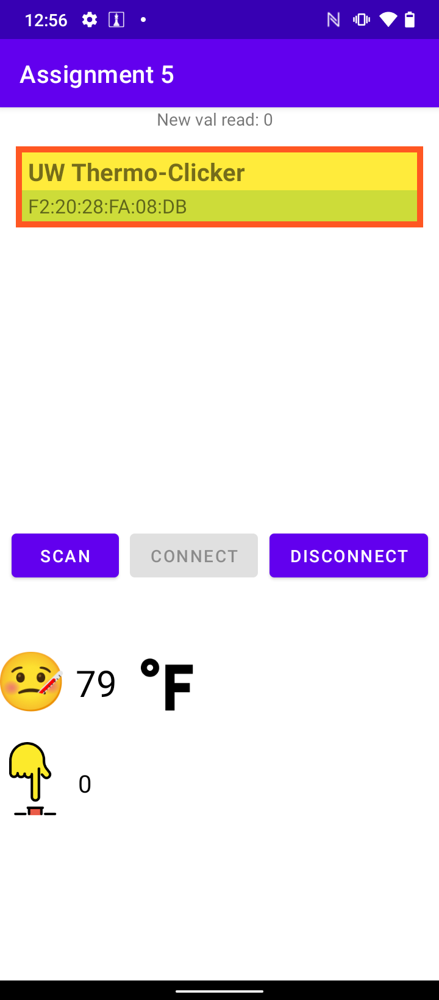
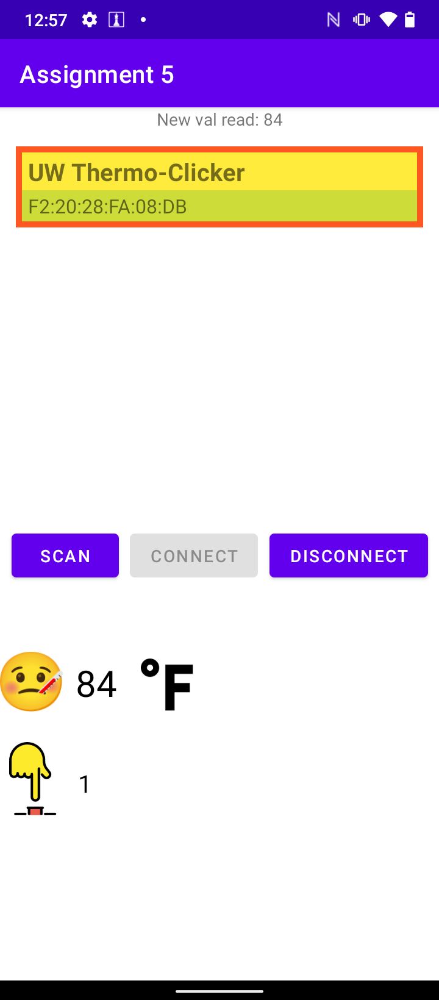
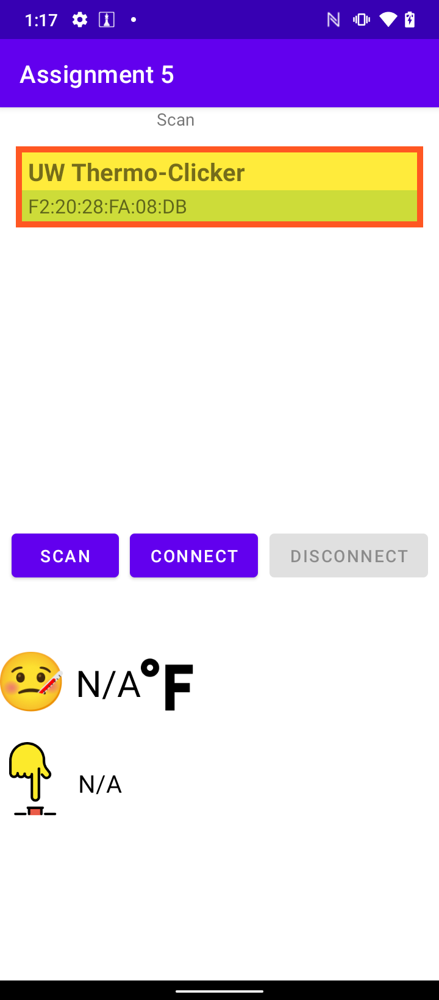

# A5/6: Android, Arduino and BLE (Jeremy Cao)

## Overview

I built building a system which use the Circuit Playground to capture the temperature and button clicks, 
then use the Flora to publish a BLE service which sends out that data, which will be consumed by an Android app connected to it.

## Using the app 

There is three button in the main page that are clickable for "Scan", "Connect", "Disconnect".
"Scan" button is enable user to search the nearby Bluetooth devices.
"Connect" button is eneble user to connect the Android mobile device to another bluetooth device (Need to long click the device's BLE name to make a selection).
"Disconnect" button eanble user to disconnect the andriod mobile device with the bluetooth device.

## Walkthrough
   

   

## Reflection/Summary

To Do:
- Selected device window frame should be changed back to blue after disconnection.

